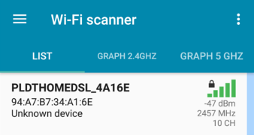
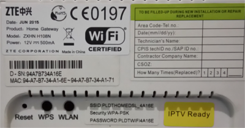
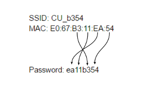
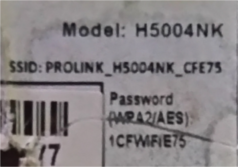

+++
title = "Default WiFi passwords"
description = ""
date = 2017-08-22
lang = "en"
extra = { version = "v0.1" }
+++

## Introduction

Living today without WiFi disconnects us from the world. While there are so many WiFi access points all around us, we can't connect to them because they're secured with a password, but we won't bother asking for the WiFi password.

Let's connect to wireless access points that still have default passwords configured.

After a router has been setup by the Internet service provider here in the Philippines, ideally they tell you to change the WiFi password, but still many routers go used everyday and still have their default WiFi password configuration.

To change the WiFi password mind you, using the router's web interface, typing in the router's IP address on a web browser. Then after going to addresses, you login using their default login credentials, go to wireless configuration optionally set security options and changing the WiFi password.

Too easy for the end user?

To identify the router's default WiFi password we need an application, preferably using an Android phone to scan for wireless access points currently around.

No need for apps with fancy names like "WiFi Password Hacker", those will just simply disappoint you and even contain malware.

Using an Android phone with [PingTools](https://play.google.com/store/apps/details?id=ua.com.streamsoft.pingtools), available on Google Play for free or using an Android phone with [WiFi Analyzer](https://play.google.com/store/apps/details?id=com.vrem.wifianalyzer), an open source application available on Google Play for free. [Source](https://github.com/VREMSoftwareDevelopment/WiFiAnalyzer).

After scanning, we can view the router's Service Set Identifier (SSID) or the name of the WiFi network, and it's Basic Service Set Identifier (BSSID) or MAC address of the router.

We can now use that to connect to our prefered WiFi access point.

## PLDT ZXHN H108N

Using PingTools WiFi scanner, we can see the MAC address of the router and we can now identify the router's default WiFi password configuration.

Now lets combine them 

SSID: PLDTHOMEDSL_4A16E

MAC: 94:A7:B7:34:A1:6E

PLDTWIFI + Last 5 characters of MAC address uppercase

Password: PLDTWIFI4A16E

	

## Iterations on PLDT routers

SSID: PLDTHOMEFIBR + 4A16E(Last 5 characters of MAC address uppercase)
Password: PLDTWIFI + B5E91(Last 5 characters inverted MAC hex value uppercase)

SSID: PLDTmyDSLPAL
Password: PLDTWIFI + Last 5 characters of MAC address uppercase

SSID: PLDTmyDSLBiz
Password: PLDTWIFI + Last 5 characters of MAC address uppercase

SSID: PLDTHOMEFIBR + Last 5 characters of MAC address
Password: wlan + Last 5 characters of inverted MAC hex value
Password-Example: wlanB5E91

SSID: HomeBro_Ultera
Password: HomeBro_ + Last 6 characters inverted MAC hex value 
Password-Example: HomeBro_CB5E91

### Inverted MAC hex value

0 - F

1 - E

2 - D

3 - C

4 - B

5 - A

6 - 9

7 - 8

8 - 7

9 - 6

A - 5

B - 4

C - 3

D - 2

E - 1

F - 0

## EPON ONU

An example with routers that are rearranging parts of the MAC address as default WiFi password.

## Globe PROLiNK H5400NK ADSL Wireless Modem

On Globe routers, placing the word "WIFI" in between the last 6 characters of its MAC.

A reminder to change your router's passwords folks, enjoy~

References: [Symbianize (Mobilarian)](https://www.mobilarian.com/showthread.php?t=1255249&p=20734036&viewfull=1#post20734036)