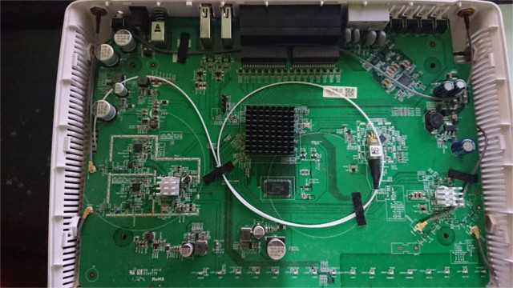
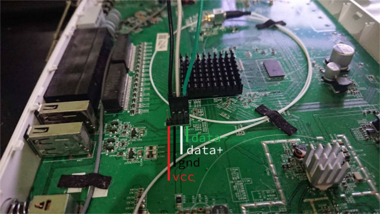

+++
title = "PLDT Home Fiber router console access"
date = 2018-05-20
+++

Continuation for hacking the PLDT FIBR AN5506-04-FA router RP2616

- [Hidden urls](/pldt-home-fiber-router-hacking)
- [Console access](#)
- [Router firmware and files](/pldt-home-fiber-router-firmware-and-files)
- [Admin access](/pldt-home-fiber-web-interface-admin-access)

## Console access 

Looking to find more information about the router, I will guide you on how to gain console access on the router.

## Requirements

A [CP2102 USB 2.0 TTL UART module 6 pin serial converter](https://www.lazada.com.ph/products/cp2102-usb-20-to-ttl-uart-module-6-pin-serial-converter-i117001765-s121288330.html) (non-affiliate link), bought from an online store. 

You will also need jumper cables, as they don't come with the CP2102. I just used the ones from my logic analyzer just laying around.

A Linux based Operating System that has GNU Screen.

## Finding the serial port

First, let's take a look under the hood.

These are the ports you're looking for

On the CP2102 connect data+ (white) to TXD, data- (green) to RXD and gnd (black) to GND.

Avoid the vcc port as you can fry your CP2102 just like I did, bought another 2 after doing that.

# Pre boot up

Before we can boot up the router we need to plug everything first. 

Start up your Linux Operating System.

On a terminal enter command `sudo screen /dev/ttyUSB0 115200` and enter your user password.

/dev/ttyUSB0 is the CP2102 device and 115200 is the baudrate or speed the terminal sends data to your terminal(?) find resource

If the command fails most likely it's not already installed you can do `sudo apt update` and install it using `sudo apt install screen`.

After entering the command the terminal will go blank since we still haven't booted the router. 

# Booting up the router

After plugging in everything, we can now boot the router up.

There are three prompts available after booting.

First prompt seems to load the router's firmware

The second prompt loads file system but has limited commands available

The third prompt will show after a few moments

Now we have access to all its directories and files, we can also get additional information about the router and its logs.

You can also leave the router to boot everything and will work as usual.

#### [Finally we can dump parts of its firmware and files](/pldt-home-fiber-router-firmware-and-files)

