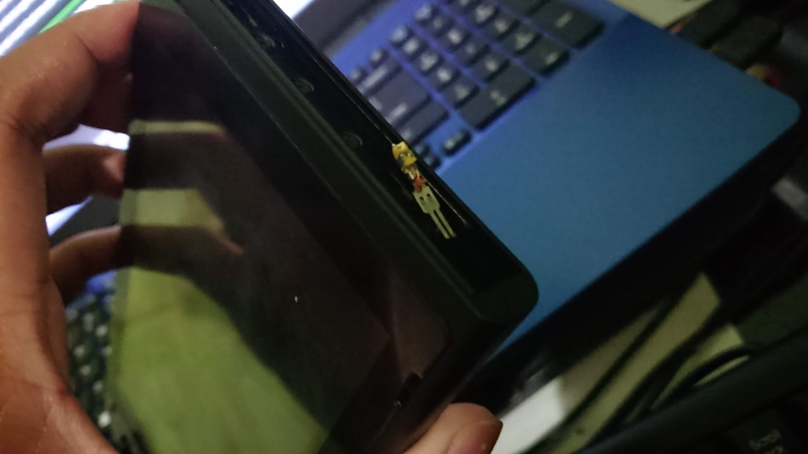
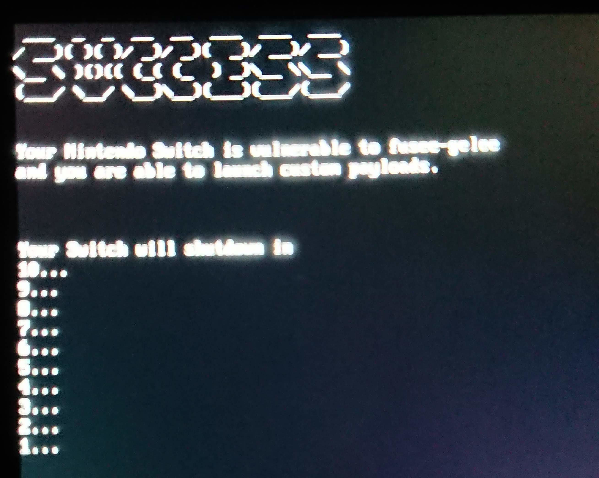
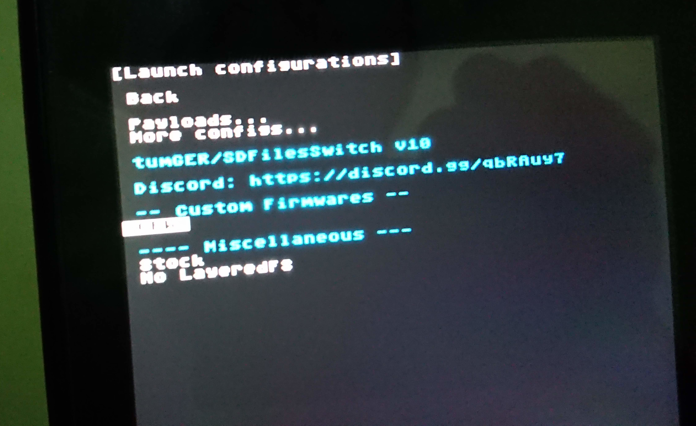
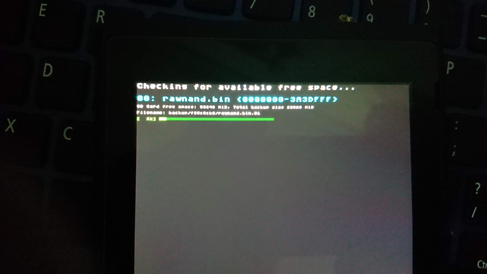
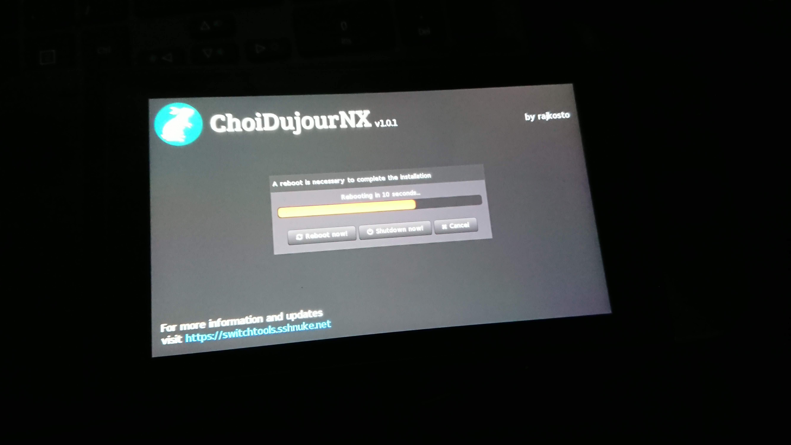
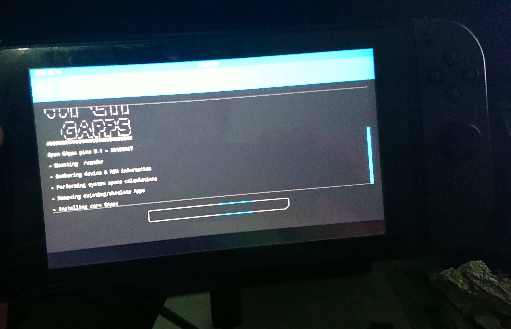
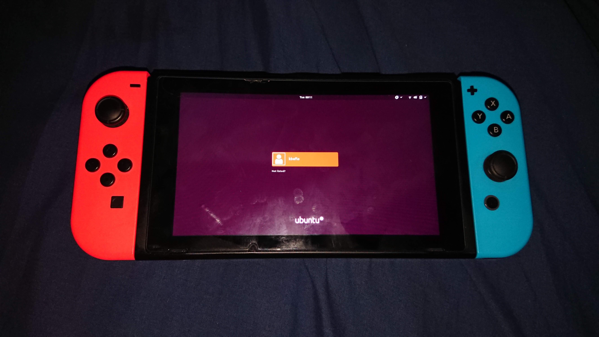
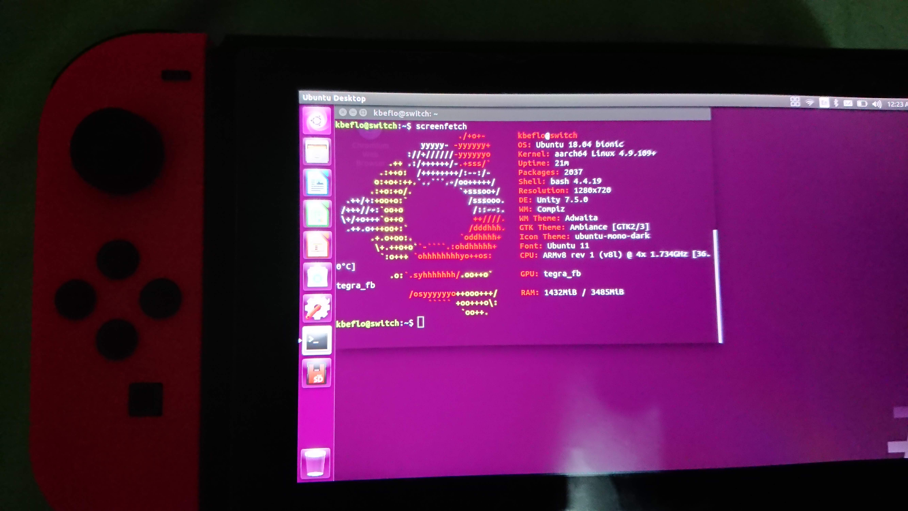

+++
title = "Switch Hacking"
description = ""
date = 2021-06-17
lang = "en"
extra = { version = "v0.1" }
+++

I purchased my Nintendo Switch at 2018-10-06

After a lot research I decided to use custom firmware at 2018-10-23

Took apart a SATA power connector and used it as a jig to boot to RCM[^1]

Checking if my Switch is vulnerable

Backup stock firmware and etc

Upgrading firmware using ChoiDujourNX[^2]

Split on one 64GB micro SD is Android and Arch Linux

switchroot LineageOS[^3] install 2019-08-09

Installing OpenGApps[^4]

Trying out switchroot Ubuntu L4T[^5]

Thank you to the awesome people contributing to the switch hacking scene!

[fusee-launcher](https://github.com/Qyriad/fusee-launcher) - A reference implementation launcher for the Fusée Gelée Tegra X1 bootROM exploit

[Atmosphere](https://github.com/Atmosphere-NX/Atmosphere) - Nintendo Switch custom firmware

[hekate](https://github.com/CTCaer/hekate) - Nintendo Switch bootloader

[switchroot.org](http://switchroot.org/) - Nintendo Switch Ubuntu, LineageOS and many more

[Homebrew Guide](https://switch.homebrew.guide/) - The Ultimate Noob Guide for Hacking your Nintendo Switch

[AtlasNX Kosmos](https://github.com/AtlasNX/Kosmos) - All-in-One CFW Package for the Nintendo Switch 

[^1]: [GBAtemp My SATA power cable RCM Jig](https://gbatemp.net/threads/my-sata-power-cable-rcm-jig.502363/)
[^2]: [ChoiDujourNX by rajkosto](https://switchtools.sshnuke.net/)
[^3]: [switchroot LineageOS](https://forum.xda-developers.com/t/rom-unofficial-switchroot-android-10.4229761/)
[^4]: [OpenGApps](https://opengapps.org/)
[^5]: [switchroot Ubuntu L4T](https://gbatemp.net/threads/l4t-ubuntu-a-fully-featured-linuxp-on-your-switch.537301/)