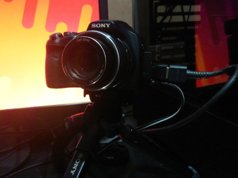
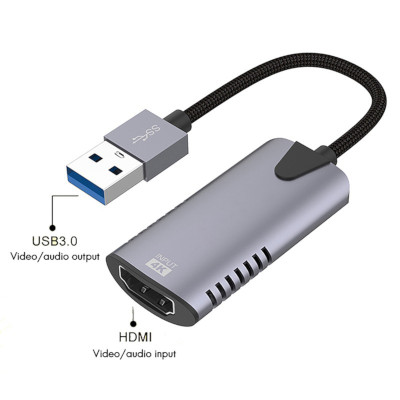
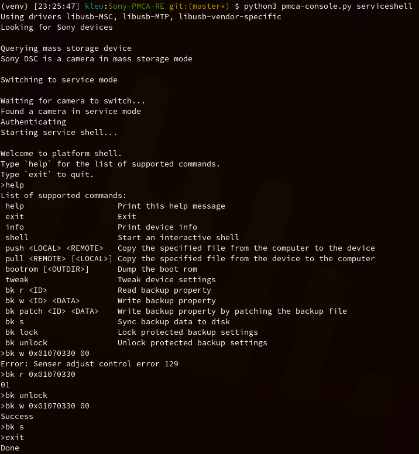
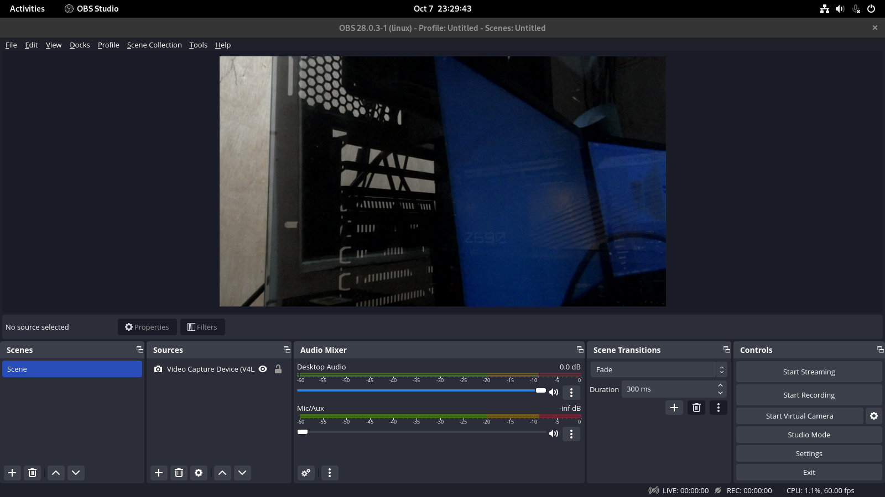

+++
title = "Sony DSC-HX100V clean HDMI capture"
date = 2022-10-08
+++

I wanted to try out our family's old camera, a Sony DSC-HX100V as a desktop camera. 

Ordered stuff like a HDMI adapter

Next I looked for a cheap capture card

I setup OBS Studio and set my camera as a video capture device.

What was bothering me was the EV value on the bottom right of the screen when getting the capture. As there isn't any option to remove it.

I tried using the OBS Studio filter crop at first but I needed a much effective solution.

I found [Sony-PMCA-RE](https://github.com/ma1co/Sony-PMCA-RE/) which is a tool that interfaces with Sony digital cameras through USB. It allows to tweak settings, dump firmware, and in some cases install custom Android apps.  

Followed through [Clean HDMI for DSC-HX200V](https://github.com/ma1co/Sony-PMCA-RE/issues/313) and [Support for DSC-HX100V](https://github.com/ma1co/Sony-PMCA-RE/issues/314). 

First I tried to run the commands on using `python pmca-console.py updatershell` but it updates the firmware which in turn loses the changes that I made. I could still backup the relevant files.

Next I had to try `python pmca-console.py serviceshell`. The address `0x01070330` is for removing the EV value from the screen. This will also lock exposure value to zero.

Changes I make now persists even after battery removal. Thank you for a well documented guide!

Configured the camera on movie mode and set scene to landscape to avoid face detection.

Now I finally have clean HDMI capture!